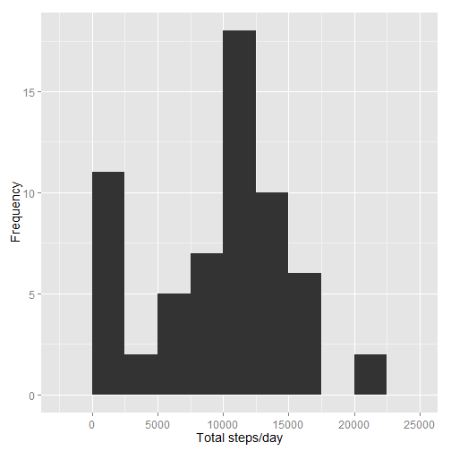
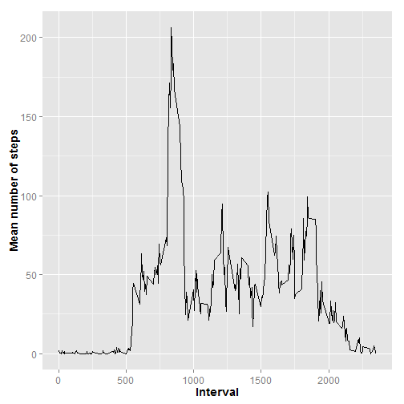
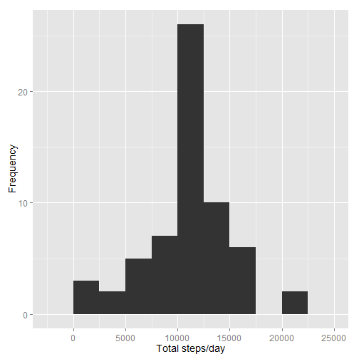
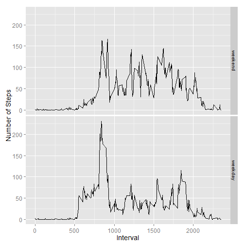

Introduction

It is now possible to collect a large amount of data about personal movement using activity monitoring devices such as a Fitbit , Nike Fuelband, or Jawbone Up. These type of devices are part of the "quantified self" movement - a group of enthusiasts who take measurements about themselves regularly to improve their health, to find patterns in their behavior, or because they are tech geeks. But these data remain underutilized both because the raw data are hard to obtain and there is a lack of statistical methods and software for processing and interpreting the data.

Loading and preprocessing the data

This assignment makes use of data from a personal activity monitoring device. This device collects data at 5 minute intervals through out the day. The data consists of two months of data from an anonymous individual collected during the months of October and November, 2012 and include the number of steps taken in 5 minute intervals each day.

The data is a comma delimited file, it includes 17,568 observations of 3 variables:

steps: Number of steps taken in a 5 min interval
date: The date when the measurement was taken in YYY-MM-DD format
interval: Identifier for the 5-min interval in which the measurement was taken
First, we read the date coercing the date column to character rather than factor


```r
setwd("C:\\Users\\rkanadib\\Documents\\RepData_PeerAssessment1")
getwd()
```

```
## [1] "C:/Users/rkanadib/Documents/RepData_PeerAssessment1"
```

```r
activityData <- read.csv ("activity.csv", header = T, sep = ",", stringsAsFactors = F)
```

Convert the date column to appropriate format

```r
activityData$date <- as.Date(activityData$date, "%Y-%m-%d")
str(activityData)
```

```
## 'data.frame':	17568 obs. of  3 variables:
##  $ steps   : int  NA NA NA NA NA NA NA NA NA NA ...
##  $ date    : Date, format: "2012-10-01" "2012-10-01" ...
##  $ interval: int  0 5 10 15 20 25 30 35 40 45 ...
```
Check the dimensions

```r
dim(activityData)
```

```
## [1] 17568     3
```

```r
head(activityData)
```

```
##   steps       date interval
## 1    NA 2012-10-01        0
## 2    NA 2012-10-01        5
## 3    NA 2012-10-01       10
## 4    NA 2012-10-01       15
## 5    NA 2012-10-01       20
## 6    NA 2012-10-01       25
```
The number of observations and variables matches the assignment description and have some blank values
Analysis

1. What is the mean total number of steps taken per day?

We can use dplyr to group and summarize the data and store it in the variable AvgDay, the following lines calculate the total number of steps per day and the mean number of daily steps:

```r
library (dplyr)
AvgDay<-activityData%>%group_by(date)%>% summarize(total.steps=sum(steps,na.rm=T),mean.steps = mean(steps, na.rm = T))
library(ggplot2)
```
Construct the histogram of the total steps

```r
g <- ggplot(AvgDay, aes(x=total.steps))
g + geom_histogram(binwidth=2500)+theme(axis.text=element_text(size=12),axis.title=element_text(size=14))+labs(y = "Frequency") + labs(x = "Total steps/day")
```

 
Median will be in this interval 10000-12500 distributed equally around the center

```r
summary(AvgDay$total.steps)
```

```
##    Min. 1st Qu.  Median    Mean 3rd Qu.    Max. 
##       0    6778   10400    9354   12810   21190
```

```r
summary (AvgDay$mean.steps)
```

```
##    Min. 1st Qu.  Median    Mean 3rd Qu.    Max.    NA's 
##  0.1424 30.7000 37.3800 37.3800 46.1600 73.5900       8
```
8 missing values noted
2. What is the daily activity pattern?
We average the number of steps across 5 min intervals, the periods where the person is most and least active

```r
AvgInterval <- activityData %>% group_by(interval) %>% summarize(mean.steps = mean(steps, na.rm = T))
```

```r
g <- ggplot( AvgInterval , aes(x = interval, y = mean.steps))
g + geom_line() + theme(axis.text = element_text(size = 12), axis.title = element_text(size = 14, face = "bold")) + labs(y = "Mean number of steps") + labs(x = "Interval")
```

 
Largest amount of steps happen between 500 and 1000
3. Imputing missing values

We noticed that there are missing values when we printed the first few rows of the activityData variable, but we have not determined what values are missing. We will calculate the percentage of missing data as well as the number of rows that contain an NA.

```r
mean(is.na(activityData$steps))
```

```
## [1] 0.1311475
```

```r
sum(is.na(activityData$steps))
```

```
## [1] 2304
```
Data 13% is missing.
Average steps during the day to fill in NAS
Check for missing values in the interval column within AvgInterval

```r
sum(is.na(AvgInterval$mean.steps))
```

```
## [1] 0
```

```r
newData <- activityData
```
Fill in missing values. If the column interval is NA, interval in the AvgInterval data is extracted to a variable . Assign mean.steps to column newData

```r
for (i in 1:nrow(newData)) {
      if (is.na(newData$steps[i])) {
            index <- newData$interval[i]
            value <- subset(AvgInterval, interval==index)
            newData$steps[i] <- value$mean.steps
      }
}
head(newData)
```

```
##       steps       date interval
## 1 1.7169811 2012-10-01        0
## 2 0.3396226 2012-10-01        5
## 3 0.1320755 2012-10-01       10
## 4 0.1509434 2012-10-01       15
## 5 0.0754717 2012-10-01       20
## 6 2.0943396 2012-10-01       25
```
Group data by date and calculate totals

```r
newAvg <- newData %>% group_by(date) %>% summarize(total.steps = sum(steps, na.rm = T))
```

```r
g <- ggplot(newAvg, aes(x=total.steps))
g + geom_histogram(binwidth = 2500) + theme(axis.text = element_text(size = 12),
      axis.title = element_text(size = 14)) + labs(y = "Frequency") + labs(x = "Total steps/day")
```

 
Filling values with the interval bumps 10000-12500 class frequency
Summaries of AvgDay is compared with  newData

```r
summary (AvgDay$total.steps)
```

```
##    Min. 1st Qu.  Median    Mean 3rd Qu.    Max. 
##       0    6778   10400    9354   12810   21190
```

```r
sd(AvgDay$total.steps, na.rm=T)
```

```
## [1] 5405.895
```

```r
summary (newAvg$total.steps)
```

```
##    Min. 1st Qu.  Median    Mean 3rd Qu.    Max. 
##      41    9819   10770   10770   12810   21190
```

```r
sd(newAvg$total.steps, na.rm=T)
```

```
## [1] 3974.391
```
 New data first quartile is closer to the mean and has a smaller standard deviation.Replacing NAs with the mean values for the time intervals results in lower variance and more clstering around the center
 4. Are there differences in activity patterns between weekdays and weekends?
Create weekday and weekend data

```r
newData$day <- ifelse(weekdays(newData$date) %in% c("Saturday", "Sunday"), "weekend", "weekday")
wkend <- filter(newData, day == "weekend")
wkday <- filter(newData, day == "weekday")
wkend <- wkend %>% group_by(interval) %>% summarize(mean.steps = mean(steps)) 
wkend$day <- "weekend"
wkday <- wkday %>% group_by(interval) %>% summarize(mean.steps = mean(steps)) 
wkday$day <- "weekday"
newInterval <- rbind(wkend, wkday)
newInterval$day <- as.factor(newInterval$day)
newInterval$day <- relevel(newInterval$day, "weekend")
```

```r
g <- ggplot (newInterval, aes (interval, mean.steps))
g + geom_line() + facet_grid (day~.) + theme(axis.text = element_text(size = 12), 
      axis.title = element_text(size = 14)) + labs(y = "Number of Steps") + labs(x = "Interval")
```

 
Weekdays activity peaks between 7AM and 9AM and activity remails below 100 for the rest. Wekend activity remains higher than the weekday activity all day and is more evenly distributed

